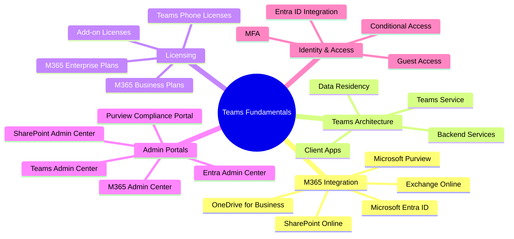
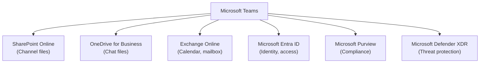
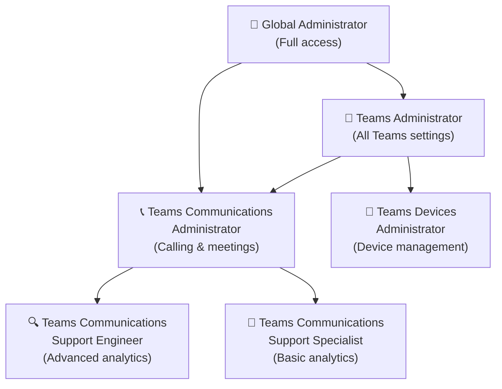

# 00 — Teams Fundamentals
> - Based on: *[Microsoft Teams Admin Documentation](https://learn.microsoft.com/en-us/MicrosoftTeams/)*
> - 📁 [← Back to Home](/ms-700-study-notes/)

---

## 🗺 Overview



---

## 🏗️ Microsoft Teams Architecture

### How Teams Fits into Microsoft 365

Microsoft Teams is the **hub for teamwork** in Microsoft 365. It integrates deeply with other M365 services, and understanding these dependencies is critical for the MS-700 exam.

| M365 Service | Relationship with Teams |
|-------------|------------------------|
| **SharePoint Online** | Stores files shared in channels; each team gets a SharePoint site |
| **OneDrive for Business** | Stores files shared in 1:1 and group chats |
| **Exchange Online** | Provides calendar, meeting scheduling, and mailbox for teams |
| **Microsoft Entra ID** | Identity provider — authentication, Conditional Access, guest access |
| **Microsoft Purview** | Compliance — DLP, retention, sensitivity labels, eDiscovery |
| **Microsoft Defender XDR** | Threat protection — Safe Links, Safe Attachments for Teams |
| **Power Platform** | Extensibility — Power Apps, Power Automate workflows in Teams |



> **⚠️ Exam Caveat:**
> - Teams files in **channels** are stored in **SharePoint Online**, not OneDrive
> - Teams files in **1:1 / group chats** are stored in the sender's **OneDrive for Business**
> - A team's **mailbox and calendar** are provided by the underlying **Microsoft 365 group** in Exchange Online

---

## 🔑 Where Teams Stores Content

| Content Type | Storage Location |
|-------------|-----------------|
| Channel messages | **Azure Cosmos DB** (Teams service) |
| Channel files | **SharePoint Online** (team site document library) |
| Chat messages | **Azure Cosmos DB** (Teams service) |
| Chat files | **OneDrive for Business** (sender's account) |
| Meeting recordings | **OneDrive** (non-channel) or **SharePoint** (channel meeting) |
| Voicemail | **Exchange Online** (user mailbox) |
| Wiki content | **SharePoint Online** (team site) |
| Calendar events | **Exchange Online** (group mailbox) |
| Teams app data | **Varies by app** (Dataverse, SharePoint, or third-party) |

---

## 📜 Licensing Overview

### Core Plans That Include Teams

| Plan | Teams Included | Key Differences |
|------|---------------|----------------|
| **Microsoft 365 Business Basic** | Yes | Web/mobile apps only, 300-user limit |
| **Microsoft 365 Business Standard** | Yes | Desktop apps + web/mobile, 300-user limit |
| **Microsoft 365 Business Premium** | Yes | + Advanced security (Defender, Intune) |
| **Microsoft 365 E3** | Yes | Enterprise — unlimited users, advanced compliance |
| **Microsoft 365 E5** | Yes | + Audio Conferencing, Phone System, advanced analytics |
| **Microsoft 365 F1/F3** | Yes | Frontline worker plans — limited features |
| **Office 365 E1/E3/E5** | Yes | Legacy plans — still valid |

### Key Add-on Licenses

| Add-on | Purpose |
|--------|---------|
| **Teams Phone Standard** | PSTN calling capabilities (auto-attendants, call queues) |
| **Audio Conferencing** | Dial-in numbers for meetings |
| **Teams Rooms Pro/Basic** | Meeting room device management |
| **Teams Premium** | Advanced meeting features (watermarks, custom branding, Copilot) |
| **Microsoft 365 Copilot** | AI-powered experiences in Teams meetings and chat |
| **Communication Credits** | Pay-per-minute for toll-free and international dial-out |

> **⚠️ Exam Caveat:**
> - **M365 E5** includes Audio Conferencing and Phone System — no separate license needed
> - **M365 E3** does NOT include Phone System — requires a **Teams Phone Standard** add-on
> - **Teams Premium** is a separate add-on even for E5 customers

---

## 🖥️ Admin Portals

| Portal | URL | Primary Use for Teams |
|--------|-----|----------------------|
| **Teams Admin Center** | admin.teams.microsoft.com | Teams policies, devices, meetings, calling, apps |
| **M365 Admin Center** | admin.microsoft.com | User/license management, M365 group settings |
| **Microsoft Entra Admin Center** | entra.microsoft.com | Identity, Conditional Access, guest settings, B2B |
| **SharePoint Admin Center** | admin.sharepoint.com (via M365) | External sharing settings affecting Teams files |
| **Microsoft Purview** | compliance.microsoft.com | DLP, retention, sensitivity labels, eDiscovery |
| **Microsoft Defender** | security.microsoft.com | Threat policies, Safe Links, Safe Attachments |

> **⚠️ Exam Caveat:**
> - **Guest access** configuration spans multiple portals — Entra (B2B), Teams admin center, SharePoint, and M365 admin center
> - **External sharing** for files in Teams channels is controlled in **SharePoint admin center**, not the Teams admin center
> - **Conditional Access policies** are configured in **Entra admin center**, not Teams admin center

---

## 👤 Teams Administrator Roles

| Role | Scope |
|------|-------|
| **Teams Administrator** | Full access to Teams admin center — manages all Teams settings, policies, and devices |
| **Teams Communications Administrator** | Manages calling and meeting features — voice, phone numbers, meeting policies |
| **Teams Communications Support Engineer** | Access to advanced call analytics and troubleshooting tools |
| **Teams Communications Support Specialist** | Access to basic call analytics (per-user) |
| **Teams Devices Administrator** | Manages Teams device configuration and profiles |
| **Global Administrator** | Full access to everything (use sparingly — least-privilege principle) |



> **⚠️ Exam Caveat:**
> - The exam frequently tests **least-privilege** — choose the most restrictive role that can complete the task
> - **Teams Communications Support Specialist** can only see **per-user** call analytics, NOT tenant-wide
> - **Teams Communications Support Engineer** can see **all user** call analytics and advanced troubleshooting

---

## 🔧 PowerShell & Microsoft Graph

### Teams PowerShell Module

```powershell
# Install the module
Install-Module -Name MicrosoftTeams -Force

# Connect
Connect-MicrosoftTeams

# Common cmdlets
Get-Team
Get-TeamUser -GroupId <GroupId>
New-Team -DisplayName "Project Alpha" -Visibility Private
Add-TeamUser -GroupId <GroupId> -User user@domain.com -Role Member
Set-TeamChannel -GroupId <GroupId> -CurrentDisplayName "General" -NewDisplayName "Main"
```

### Microsoft Graph API

| Endpoint | Purpose |
|----------|---------|
| `GET /teams` | List teams |
| `POST /teams` | Create a team |
| `GET /teams/{id}/channels` | List channels |
| `POST /teams/{id}/channels` | Create a channel |
| `GET /teams/{id}/members` | List members |
| `GET /communications/callRecords` | Call quality data |

> **⚠️ Exam Caveat:**
> - **PowerShell** and **Microsoft Graph** are both valid for bulk operations — know when each is appropriate
> - Creating a team from an **existing M365 group** uses `New-Team -GroupId <existingGroupId>`
> - **Microsoft Graph** is required for some advanced scenarios like reading call records

---

## 🌐 Network Fundamentals for Teams

### Key Ports and Protocols

| Protocol | Port Range | Purpose |
|----------|-----------|---------|
| **HTTPS** | TCP 443 | Signaling, authentication, file transfer |
| **UDP** | 3478–3481 | Real-time media (audio, video, screen sharing) |
| **TCP** | 80 | HTTP fallback |
| **STUN/TURN** | UDP 3478 | NAT traversal for media |

### Bandwidth Requirements (Per User)

| Scenario | Minimum Bandwidth |
|----------|-------------------|
| Audio call (1:1) | **~30 kbps** |
| Video call (1:1, 720p) | **~1.5 Mbps** |
| Video call (1:1, 1080p) | **~2.5 Mbps** |
| Screen sharing | **~200 kbps** |
| Large meeting (video gallery) | **~2.5–4 Mbps** |

> **⚠️ Exam Caveat:**
> - **UDP is preferred** for real-time media — if UDP is blocked, Teams falls back to TCP, resulting in degraded quality
> - **Microsoft 365 network connectivity test tool** and **Network Planner** in the Teams admin center are used to assess readiness
> - Know the difference between **Network Planner** (capacity planning) and **Network Assessment Tool** (connectivity testing)

---

## 📚 Further Reading

| Resource | Link |
|----------|------|
| Teams Admin Documentation | [Microsoft Teams Admin Docs](https://learn.microsoft.com/en-us/MicrosoftTeams/) |
| Teams Architecture Diagrams | [Teams Architecture Overview](https://learn.microsoft.com/en-us/MicrosoftTeams/teams-architecture-solutions-posters) |
| Teams Licensing | [Teams Licensing Guide](https://learn.microsoft.com/en-us/MicrosoftTeams/teams-add-on-licensing/microsoft-teams-add-on-licensing) |
| Network Readiness | [Prepare Network for Teams](https://learn.microsoft.com/en-us/MicrosoftTeams/prepare-network) |

---

[🔧 Next: Domain 1 — Configure & Manage a Teams Environment →](/ms-700-study-notes/01-configure-manage-environment/)
