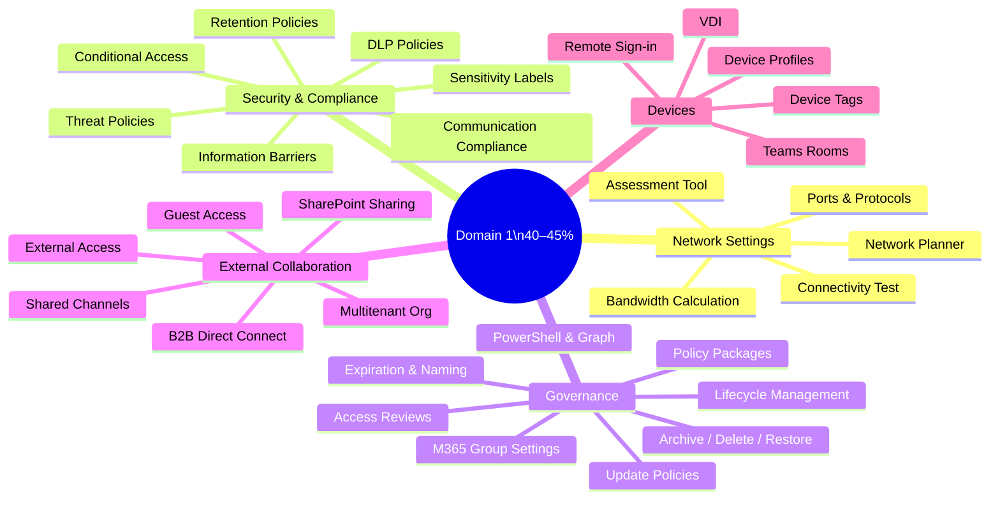
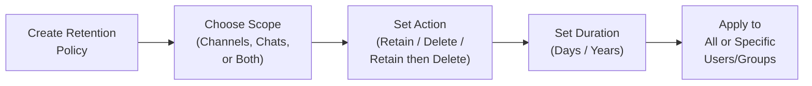
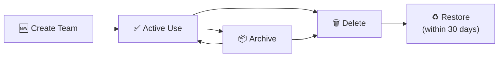
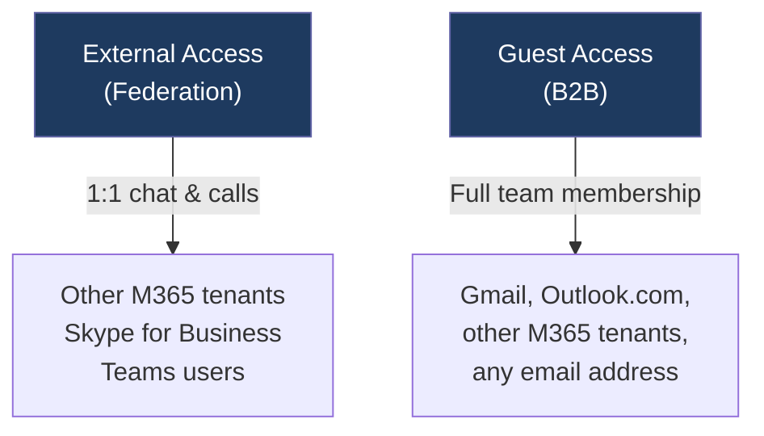

# 01 — Configure & Manage a Teams Environment 40–45%
> - Based on: *[MS-700 Study Guide](https://learn.microsoft.com/en-us/credentials/certifications/resources/study-guides/ms-700)*
> - 📁 [← Back to Home](/ms-700-study-notes/)

---

## 🗺 Domain Overview

---

## 🌐 1.1 Plan Network Settings for Teams

### Network Planner

The **Network Planner** in the Teams admin center helps calculate bandwidth requirements based on the number of users, locations, and expected usage scenarios.

| Step | Action |
|------|--------|
| 1 | Add **network sites** (office locations) with user counts |
| 2 | Define a **network plan** linking sites |
| 3 | Select **personas** — profiles describing usage patterns (audio, video, screen sharing) |
| 4 | Run the report to see **bandwidth impact per site** |

### Microsoft Teams Network Assessment Tool

A downloadable tool that tests **network connectivity** from a client machine to the Teams service:
- Tests UDP connectivity to Microsoft relay servers
- Measures **packet loss**, **jitter**, and **latency**
- Reports whether the connection meets Teams quality thresholds

### Microsoft 365 Network Connectivity Test Tool

An online tool at **connectivity.office.com** that evaluates:
- Network path to the nearest Microsoft service front door
- DNS resolution quality
- TCP and UDP connectivity
- Exchange, SharePoint, and Teams-specific tests

### Key Ports and Protocols

| Protocol | Port | Purpose |
|----------|------|---------|
| **HTTPS** | TCP 443 | Signaling, authentication, API calls |
| **STUN/TURN** | UDP 3478 | Media relay — NAT traversal |
| **Media** | UDP 3479–3481 | Audio, video, screen sharing |
| **HTTP** | TCP 80 | Certificate revocation, CDN |

> **⚠️ Exam Caveat:**
> - **UDP 3478–3481** must be open for optimal media quality — if blocked, Teams falls back to TCP 443 with degraded quality
> - **Network Planner** = capacity planning (how much bandwidth do I need?)
> - **Network Assessment Tool** = connectivity testing (can I reach Microsoft's servers with acceptable quality?)
> - Know the **quality thresholds**: latency < 50 ms, jitter < 30 ms, packet loss < 1%

---

## 🔒 1.2 Manage Security and Compliance Settings for Teams

### Licensing for Security & Compliance

| Feature | Required License |
|---------|-----------------|
| DLP for Teams chat/channels | **M365 E5** or **E5 Compliance** add-on |
| Sensitivity labels | **M365 E3+** (basic), **E5** for auto-labeling |
| Retention policies | **M365 E3+** |
| Information barriers | **M365 E5** or **E5 Compliance** add-on |
| Communication compliance | **M365 E5** or **E5 Compliance** add-on |
| Insider risk management | **M365 E5** or **E5 Compliance** add-on |
| eDiscovery (Premium) | **M365 E5** or **E5 eDiscovery** add-on |
| Microsoft Defender for Office 365 | **M365 E5** or **Defender for Office 365 Plan 1/2** |

### Threat Policies in Microsoft Defender XDR

| Policy | Purpose |
|--------|---------|
| **Safe Links** | Scans URLs in Teams messages — rewrites and checks at click time |
| **Safe Attachments** | Scans files shared in Teams for malware |
| **Anti-phishing** | Protects against impersonation and spoofing in Teams |

### Retention Policies

| Setting | Description |
|---------|-------------|
| **Retain** | Keep messages for a specified duration |
| **Delete** | Remove messages after a specified period |
| **Retain then delete** | Keep for X days, then auto-delete |
| **Scope** | Can target Teams channel messages, Teams chats, or both |

### Sensitivity Labels

Sensitivity labels can be applied to **Teams**, **M365 Groups**, and **Sites** to control:
- **Privacy** — Public vs. Private
- **External access** — Whether guests can be added
- **Unmanaged device access** — Block or limit access from non-compliant devices
- **Meeting settings** — Watermarks, end-to-end encryption, lobby controls

### Data Loss Prevention (DLP)

DLP policies for Teams can monitor and block sharing of sensitive information in:
- **Chat messages** (1:1 and group chats)
- **Channel messages** (standard, private, and shared channels)

| DLP Action | Behavior |
|-----------|----------|
| **Block** | Message is blocked; sender sees a policy tip |
| **Notify** | Message is sent; sender/admin receives a notification |
| **Override** | Sender can provide business justification to send |

### Conditional Access Policies

Configured in **Microsoft Entra admin center** — can target the **Office 365** cloud app (which includes Teams):

| Condition | Example |
|-----------|---------|
| **User/group** | Apply to all users except break-glass accounts |
| **Location** | Block from untrusted locations |
| **Device platform** | Require compliant device for iOS/Android |
| **Client app** | Target browser, mobile, or desktop |
| **Grant** | Require MFA, compliant device, or Entra hybrid join |
| **Session** | App-enforced restrictions, sign-in frequency |

### Information Barriers (IB)

Prevent specific groups of users from communicating with each other in Teams:

| Scenario | Example |
|----------|---------|
| **Financial services** | Chinese wall between investment banking and research |
| **Education** | Separate student groups |
| **Government** | Compartmentalize departments |

IB policies are defined in **Microsoft Purview** and use **user segment** definitions based on Entra ID attributes.

### Communication Compliance & Insider Risk Management

| Feature | Purpose |
|---------|---------|
| **Communication compliance** | Detects policy violations in Teams messages (harassment, sensitive data, regulatory) |
| **Insider risk management** | Identifies risky user activities — data leaks, security violations |

> **⚠️ Exam Caveat:**
> - **Conditional Access** targets the **Office 365** cloud app, not a "Teams" app specifically
> - **DLP policies** for Teams require **E5** or the **E5 Compliance** add-on
> - **Information barriers** work on a **segment** model — users in different segments cannot communicate
> - **Sensitivity labels** applied to a team control the team's privacy and guest access, not individual messages

---

## 🏛️ 1.3 Plan and Implement Governance for Teams

### Lifecycle Management

| Operation | Effect |
|-----------|--------|
| **Archive** | Team becomes read-only — content preserved, no new messages |
| **Delete** | Soft-delete for 30 days — can be restored by admin |
| **Restore** | Recovers deleted M365 group (and its team) within 30-day window |
| **Unarchive** | Re-activates an archived team |

### Update Policies

Control how Teams client updates are deployed:
- **Public preview** — Enable users to access preview features
- **Office preview** — Use the Office Current Channel (Preview) for Teams updates

### Policy Packages

Pre-defined bundles of policies designed for specific roles:

| Package | Target Users |
|---------|-------------|
| **Education (Teacher)** | Messaging, meeting, and app policies for teachers |
| **Education (Student)** | Restrictive messaging and meeting policies |
| **Frontline Worker** | Shift-based policies, limited app access |
| **Healthcare (Clinical Worker)** | Messaging policies with patient safety features |
| **Small/Medium Business** | Standard policies for SMB environments |

### Microsoft 365 Group Settings

Since every team has an underlying **M365 group**, group-level settings affect Teams:

| Setting | Configured In |
|---------|---------------|
| **Who can create M365 groups** | **Entra ID** (PowerShell — `Set-AzureADDirectorySetting`) |
| **Expiration policy** | **Entra admin center** — groups expire after 90/180/365 days if not renewed |
| **Naming policy** | **Entra admin center** — prefix/suffix rules and blocked words |
| **Default classification** | **Entra admin center** — label for sensitivity |

### Expiration Policy

| Setting | Options |
|---------|---------|
| **Lifetime** | 90, 180, or 365 days |
| **Notification** | Owners notified 30 days, 15 days, and 1 day before expiration |
| **Auto-renew** | Groups with activity auto-renew (Teams message, SharePoint file access, etc.) |
| **Scope** | All groups or selected groups |

### Naming Policy

| Type | Example |
|------|---------|
| **Prefix** | `GRP_` + group name → `GRP_Marketing` |
| **Suffix** | group name + `_US` → `Marketing_US` |
| **Blocked words** | Prevents words like `CEO`, `Payroll` in group names |

### Access Reviews

**Microsoft Entra Access Reviews** for teams and groups:
- Review membership of teams periodically
- Reviewers: team owners, specific users, or self-review
- Auto-remove users who don't confirm access
- Requires **Entra ID P2** license

> **⚠️ Exam Caveat:**
> - **Restricting M365 group creation** requires **PowerShell** — you cannot do this in the M365 admin center UI
> - **Archived teams** are read-only but the content (files, messages) is still accessible
> - **Soft-deleted groups** can be restored within **30 days** — after that, deletion is permanent
> - **Expiration policies** only apply to M365 groups — the exam may test whether a group was auto-renewed due to activity

---

## 🌍 1.4 Configure and Manage External Collaboration

### External Access vs. Guest Access

| Feature | External Access | Guest Access |
|---------|----------------|--------------|
| **What it is** | Federation — chat/call with users in other M365 tenants | Users from outside your org added as members of a team |
| **Identity** | User stays in their home tenant | User is added as a **guest** in your Entra ID |
| **Access scope** | 1:1 chat and calling only (no team membership) | Full team membership — channels, files, apps |
| **File sharing** | No | Yes (SharePoint/OneDrive) |
| **Control granularity** | Domain allow/deny lists | Per-team or tenant-wide |
| **Configured in** | Teams admin center → External access | Multiple portals (see below) |

### Guest Access Configuration Portals

| Portal | Setting |
|--------|---------|
| **Microsoft Entra ID** → External Identities | B2B collaboration settings — who can invite guests, which domains |
| **Teams Admin Center** → Guest access | Enable/disable guest access, permissions (messaging, calling, meetings) |
| **M365 Admin Center** → Settings → Org settings → M365 Groups | Allow group owners to add guests |
| **SharePoint Admin Center** → Sharing | External sharing level (affects files in Teams channels) |

### SharePoint External Sharing Levels

| Level | Description |
|-------|-------------|
| **Anyone** | Anonymous links allowed |
| **New and existing guests** | Guests must authenticate |
| **Existing guests** | Only guests already in directory |
| **Only people in your organization** | No external sharing |

### Shared Channels

Allow collaboration with **external users without adding them as guests**:
- External users stay in their home tenant (no guest account created)
- Uses **B2B direct connect** in Entra ID
- Both tenants must configure **cross-tenant access settings**
- External users see the shared channel in their own Teams client

### B2B Direct Connect

Configured in **Entra admin center** → Cross-tenant access settings:

| Setting | Description |
|---------|-------------|
| **Inbound** | Which external orgs can access your shared channels |
| **Outbound** | Which of your users can access external shared channels |
| **Trust settings** | Whether to trust MFA and device compliance from the external tenant |

### Multitenant Organization (MTO)

For organizations with **multiple Entra ID tenants** (e.g., after mergers):
- Users across tenants appear as **internal** in Teams
- Enables seamless chat, calling, and presence across tenants
- Configured via **cross-tenant synchronization** in Entra ID

> **⚠️ Exam Caveat:**
> - **External access** = federation (chat/call only); **Guest access** = B2B (full team membership)
> - **Shared channels** use **B2B direct connect**, NOT traditional guest access
> - **SharePoint sharing settings** can block file sharing in Teams even if Teams guest access is enabled
> - Guest access must be enabled in **multiple portals** — disabling in any one can block it
> - **Domain allow/deny lists** for external access can now be scoped to **specific users and groups**, not just tenant-wide

---

## 📱 1.5 Manage Teams Clients and Devices

### Teams Phone Licensing

| License | Includes |
|---------|----------|
| **Microsoft 365 E5** | Phone System built in |
| **Teams Phone Standard** | Add-on for E1/E3 — provides Phone System |
| **Calling Plan** | Add-on — PSTN connectivity via Microsoft |
| **Operator Connect** | PSTN via a certified operator |
| **Direct Routing** | PSTN via your own SBC |
| **Audio Conferencing** | Dial-in for meetings (included in E5) |

### Teams Rooms

| Component | Description |
|-----------|-------------|
| **Resource account** | Entra ID account with a room mailbox — requires a **Teams Rooms license** |
| **Teams Rooms Pro** | Full-featured — intelligent audio, front row, management in Teams admin center |
| **Teams Rooms Basic** | Limited to 25 rooms — basic join, share, management |
| **Configuration profiles** | Apply settings to groups of devices (volume, display, proximity join) |

### Device Management

| Feature | Description |
|---------|-------------|
| **Configuration profiles** | Group settings applied to Teams devices (phones, displays, panels) |
| **Device tags** | Organize and filter devices in the Teams admin center |
| **Firmware updates** | Managed through Teams admin center — auto-update or manual |
| **Remote sign-in** | Provision and sign in to devices remotely — no user interaction needed |
| **Device health** | Monitor device status, connectivity, and peripherals |

### Teams for VDI

| VDI Platform | Support Level |
|-------------|--------------|
| **Azure Virtual Desktop** | Optimized — media offloading to local endpoint |
| **Citrix Virtual Apps and Desktops** | Optimized with Citrix HDX |
| **VMware Horizon** | Optimized with media optimization pack |
| **Windows 365** | Native Teams integration |

> **⚠️ Exam Caveat:**
> - **Resource accounts** for auto-attendants and call queues need a **Teams Phone Resource Account** license (free)
> - **Teams Rooms** devices need their own **dedicated resource account** — not a user account
> - **VDI optimization** redirects media processing to the local endpoint — without it, media runs in the virtual session (poor quality)
> - **Remote sign-in** uses a verification code displayed on the device that the admin enters in Teams admin center

---

## 📝 Domain 1 — Quick-Reference Scenarios

| Scenario | Answer |
|----------|--------|
| Need to assess bandwidth for a new office | **Network Planner** in Teams admin center |
| Test UDP connectivity to Microsoft relays | **Microsoft Teams Network Assessment Tool** |
| Block specific sensitive info in Teams chats | **DLP policy** in Microsoft Purview |
| Prevent two departments from chatting | **Information barrier** policies |
| Control who can create new teams | **Restrict M365 group creation** via PowerShell in Entra ID |
| Allow external users in a shared channel | **B2B direct connect** cross-tenant access settings |
| Set teams to expire if inactive | **M365 group expiration policy** in Entra admin center |
| Let an external partner join a team as a member | **Guest access** (B2B) |
| Let a user chat with someone in another org | **External access** (federation) |
| Deploy settings to 50 Teams phones at once | **Configuration profiles** in Teams admin center |

---

[← Previous: Teams Fundamentals](/ms-700-study-notes/00-teams-fundamentals/){: .btn .btn-outline .fs-5 .mr-2 }
[Next → 02 — Teams, Channels, Chats & Apps](/ms-700-study-notes/02-teams-channels-chats-apps/){: .btn .btn-primary .fs-5 }

[🏠 Home](/ms-700-study-notes/){: .btn .btn-outline .fs-3 }
