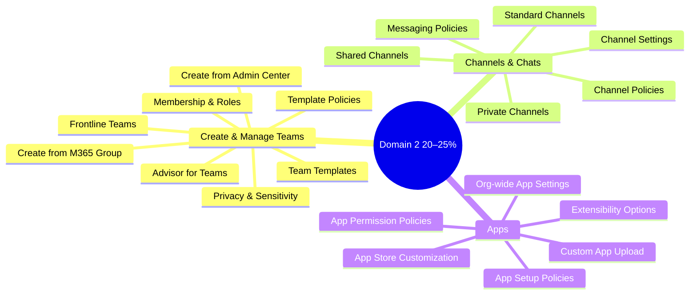
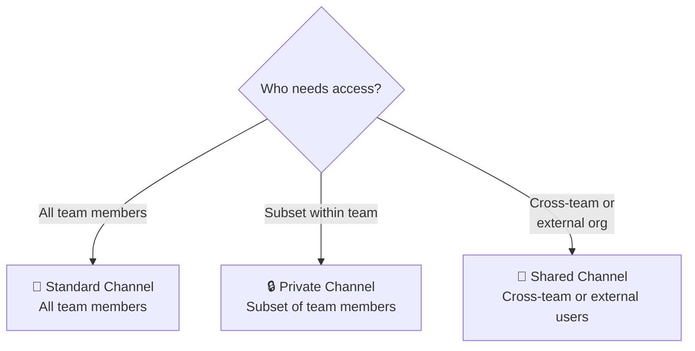
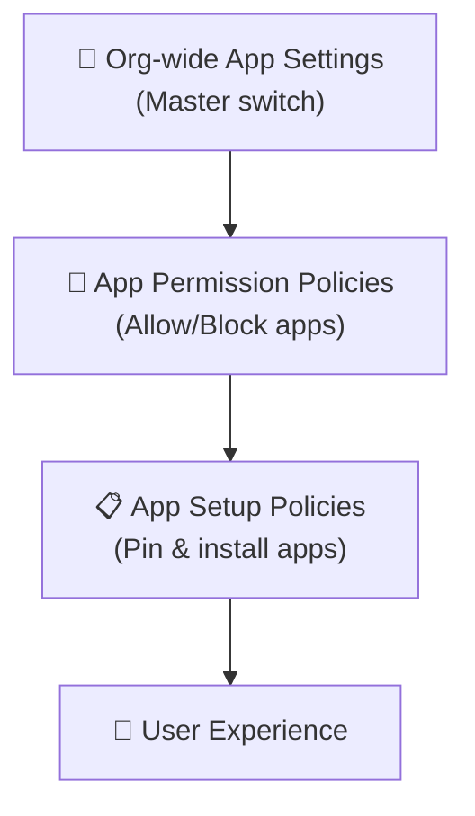

# 02 — Manage Teams, Channels, Chats & Apps 20–25%
> - Based on: *[MS-700 Study Guide](https://learn.microsoft.com/en-us/credentials/certifications/resources/study-guides/ms-700)*
> - 📁 [← Back to Home](/ms-700-study-notes/)

---

## 🗺 Domain Overview

---

## 🏗️ 2.1 Create and Manage Teams

### Advisor for Teams

A built-in tool in the Teams admin center that helps plan a Teams rollout:
- Creates a **deployment team** with channels for each workload
- Provides **Planner tasks** for rollout steps
- Covers: Chat, Teams & Channels, Meetings & Conferencing, and Calling

### Ways to Create a Team

| Method | Best For |
|--------|---------|
| **Teams admin center** | Admin-created teams for org-wide initiatives |
| **Teams client** | End-user self-service creation |
| **PowerShell** (`New-Team`) | Bulk creation, automation, scripting |
| **Microsoft Graph API** | Application-driven creation, workflows |
| **From existing M365 group** | Converting a group that already has members and content |
| **From existing SharePoint site** | Linking a team to a SharePoint team site |
| **From existing team** | Cloning settings, channels, tabs (not content) |
| **From a template** | Standardized team structures |

### Team Templates

Pre-built structures with predefined channels, tabs, and apps:

| Template | Use Case |
|----------|----------|
| **Manage a Project** | Project planning with Planner tab |
| **Manage an Event** | Event coordination channels |
| **Onboard Employees** | New hire onboarding structure |
| **Organize Help Desk** | Ticketing and support channels |
| **Incident Response** | Crisis management structure |
| **Hospital Ward** | Healthcare team structure |
| **Store Operations** (Retail) | Retail frontline teams |

**Template policies** control which templates are visible to specific users or groups.

### Team Roles and Membership

| Role | Capabilities |
|------|-------------|
| **Owner** | Manage settings, add/remove members, manage channels, delete team |
| **Member** | Post messages, add tabs, create channels (if allowed), use apps |
| **Guest** | Limited access — can post, view files, join meetings (permissions configurable) |

| Setting | Options |
|---------|---------|
| **Max owners** | Recommended: 2–5; max: 100 |
| **Max members** | 25,000 per team |
| **Org-wide team** | Auto-includes all users; max 10,000 members (5 org-wide teams limit) |

### Privacy and Sensitivity Settings

| Setting | Options |
|---------|---------|
| **Privacy** | **Private** (invite-only) or **Public** (anyone in org can join) |
| **Sensitivity label** | Controls privacy, guest access, sharing, and unmanaged device access |
| **Team settings** | @mentions, fun features (GIFs, stickers), member permissions |

### Frontline Teams and Experiences

| Feature | Description |
|---------|-------------|
| **Frontline teams** | Deploy teams at scale for shift-based workers |
| **Shifts** | Schedule management built into Teams |
| **Walkie Talkie** | Push-to-talk communication |
| **Tasks** | Centralized task management published from HQ |
| **Approvals** | Request and approve workflows in Teams |

> **⚠️ Exam Caveat:**
> - Creating a team from an **existing M365 group** converts the group but does NOT clone content from another team
> - **Org-wide teams** are limited to **10,000 members** and **5 teams** per tenant
> - **Template policies** determine which templates users see — not which templates exist
> - When a team is created, a **M365 group**, **SharePoint site**, **Exchange mailbox**, and **OneNote notebook** are all auto-provisioned

---

## 💬 2.2 Manage Channels and Chats

### Channel Types Comparison

| Feature | Standard | Private | Shared |
|---------|----------|---------|--------|
| **Visibility** | All team members | Invited members only | Invited members (incl. external) |
| **SharePoint site** | Team's site | Separate site collection | Separate site collection |
| **Owner** | Team owners | Channel creator + designated owners | Channel creator + designated owners |
| **Guest access** | Yes (if team allows) | Yes (if team allows) | No guests — uses B2B direct connect |
| **External users** | Via guest access | Via guest access | Via shared channels (B2B direct connect) |
| **Max per team** | 1,000 (incl. deleted) | 30 | 1,000 |
| **eDiscovery** | Yes | Yes | Yes |
| **DLP** | Yes | Yes | Yes |
| **Tabs/apps** | Full support | Partial (some restrictions) | Partial |

### Channel Settings

| Setting | Description |
|---------|-------------|
| **Moderation** | Control who can start new posts (owners vs. everyone) |
| **Connectors** | Incoming webhooks and third-party integrations |
| **Tabs** | Pin apps, documents, or websites at the top |
| **Auto-favorite** | Show channel in members' channel list by default |

### Teams Policies for Channels

| Policy Area | Controls |
|-------------|----------|
| **Teams policy** | Who can create private channels, who can create shared channels |
| **Channel creation** | Allow/block members from creating channels |
| **Channel sharing** | Allow/block shared channels with external orgs |

### Messaging Policies

| Setting | Description |
|---------|-------------|
| **Delete sent messages** | Allow users to delete their sent messages |
| **Edit sent messages** | Allow users to edit after sending |
| **Read receipts** | User-controlled, on for everyone, or off for everyone |
| **Chat** | Enable or disable private chat |
| **Giphy** | Allow animated GIFs (with content rating filter) |
| **Memes** | Allow meme creation in conversations |
| **Stickers** | Allow stickers in messages |
| **URL previews** | Auto-generate previews for pasted links |
| **Translate messages** | Allow inline message translation |
| **Immersive Reader** | Enable reading mode for accessibility |
| **Priority notifications** | Urgent messages with repeated notifications |
| **Voice messages** | Allow recording voice messages in chat |

> **⚠️ Exam Caveat:**
> - **Private channels** have their own **separate SharePoint site collection** — not the team's default site
> - **Shared channels** do NOT support guest access — they use **B2B direct connect** exclusively
> - **Standard channels** — max 1,000 per team (including soft-deleted channels within 30-day retention)
> - **Private channels** — max 30 per team
> - **Messaging policies** are assigned per-user, not per-team — a user's policy follows them across all teams

---

## 📱 2.3 Manage Apps for Teams

### App Management Hierarchy

### Org-wide App Settings

| Setting | Description |
|---------|-------------|
| **Third-party apps** | Master toggle — enable or disable all third-party apps |
| **Custom apps** | Allow or block uploading of custom (LOB) apps |
| **Default apps** | Microsoft-published apps (always available unless blocked) |

### App Permission Policies

Control **which apps** users can access:

| Scope | Options |
|-------|---------|
| **Microsoft apps** | Allow all, block all, or allow/block specific apps |
| **Third-party apps** | Allow all, block all, or allow/block specific apps |
| **Custom apps** | Allow all, block all, or allow/block specific apps |

### App Setup Policies

Control **how apps appear** for users:

| Setting | Description |
|---------|-------------|
| **Pinned apps** | Force-pin apps to the Teams sidebar (app bar) |
| **Installed apps** | Pre-install apps (users see them without manual install) |
| **User pinning** | Allow or prevent users from pinning their own apps |
| **App bar order** | Set the order of pinned apps |

### App Consent and Permissions

| Consent Type | Description |
|-------------|-------------|
| **Resource-specific consent (RSC)** | App requests permissions to specific team resources |
| **Admin consent** | Admin grants permissions on behalf of all users |
| **User consent** | Users can consent to apps themselves (if allowed by policy) |

### Teams App Store Customization

| Customization | Description |
|---------------|-------------|
| **Logo** | Custom org logo on the app store |
| **Background** | Custom background image |
| **Text color** | Brand-aligned text color |
| **Featured apps** | Highlight specific apps for users |

### Extensibility Options

| Option | Description | Best For |
|--------|-------------|----------|
| **Tabs** | Embed web apps or content in channels/chats | Dashboards, tools, documents |
| **Messaging extensions** | Search and share content from within compose box | Quick lookups, ticket insertion |
| **Bots** | Conversational apps for automation | Q&A, notifications, workflows |
| **Connectors** | Push notifications from external services | Alerts from Jira, GitHub, etc. |
| **Workflows** | Power Automate flows triggered in Teams | Approvals, notifications |
| **Meeting extensions** | Apps that enhance the meeting experience | Polls, Q&A, whiteboarding |

### Upload Custom Apps

| Method | Description |
|--------|-------------|
| **Sideloading** | Upload app package directly (must be enabled in policy) |
| **Org app catalog** | Publish to your organization's app store |
| **Microsoft Partner Center** | Publish to the public Teams app store |

> **⚠️ Exam Caveat:**
> - **Org-wide settings override** permission and setup policies — if third-party apps are disabled org-wide, no permission policy can allow them
> - **App permission policies** control what apps users CAN use; **app setup policies** control what apps users SEE by default
> - **Custom app upload** (sideloading) must be enabled in **both** org-wide settings AND the user's app setup policy
> - **Purchasing apps** from the Teams store requires **admin approval** if cost is involved — configured in the Teams admin center

---

## 📝 Domain 2 — Quick-Reference Scenarios

| Scenario | Answer |
|----------|--------|
| Need a channel visible only to 5 team members | **Private channel** |
| Need to collaborate with users in another M365 tenant | **Shared channel** (B2B direct connect) |
| Standardize new team structures across the org | **Team templates** + template policies |
| Block a specific third-party app for all users | **App permission policy** — block the specific app |
| Force-pin an app to every user's sidebar | **App setup policy** — add to pinned apps |
| Prevent users from deleting their sent messages | **Messaging policy** — disable delete sent messages |
| Deploy teams for 5,000 retail store workers | **Frontline team** deployment |
| Convert an existing SharePoint site into a team | Create team **from existing SharePoint site** |
| Allow users to upload custom-built apps | Enable **custom apps** in org-wide settings + app setup policy |
| Control which templates users see when creating teams | **Template policies** |

---

[← Previous: Configure & Manage Environment](/ms-700-study-notes/01-configure-manage-environment/){: .btn .btn-outline .fs-5 .mr-2 }
[Next → 03 — Meetings & Calling](/ms-700-study-notes/03-meetings-and-calling/){: .btn .btn-primary .fs-5 }

[🏠 Home](/ms-700-study-notes/){: .btn .btn-outline .fs-3 }
