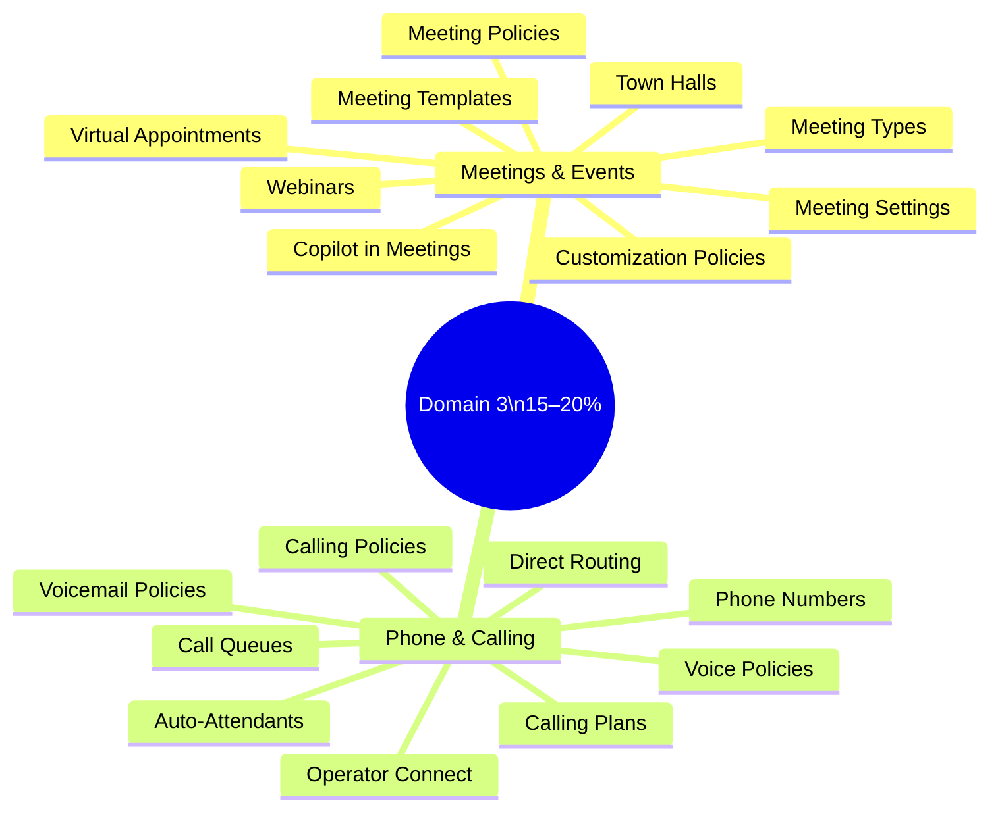
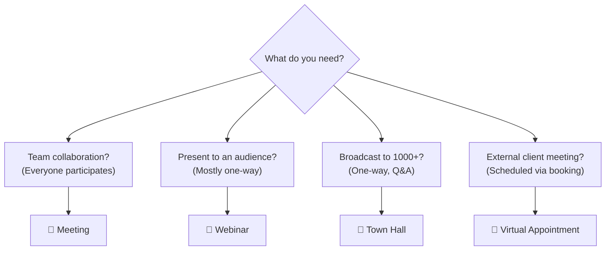
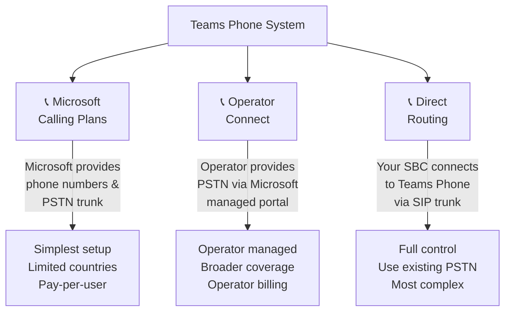
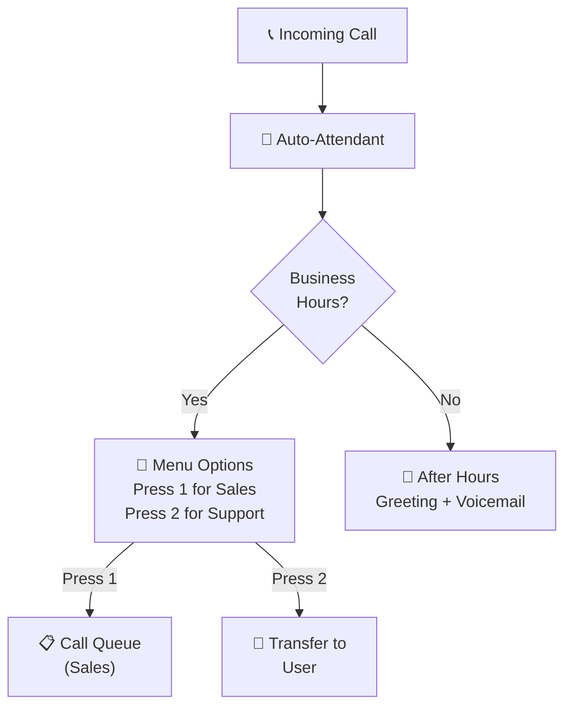

# 03 — Manage Meetings & Calling 15–20%
> - Based on: *[MS-700 Study Guide](https://learn.microsoft.com/en-us/credentials/certifications/resources/study-guides/ms-700)*
> - 📁 [← Back to Home](/ms-700-study-notes/)

---

## 🗺 Domain Overview

---

## 📅 3.1 Manage Meetings and Events

### Meeting Types Comparison

| Type | Purpose | Max Attendees | Interactive | Registration |
|------|---------|--------------|-------------|-------------|
| **Meeting** | Standard collaboration | 1,000 (view-only up to 20,000) | Full two-way | Optional |
| **Webinar** | Presentations to large audiences | 1,000 | Limited (Q&A, chat) | Yes |
| **Town Hall** | Large broadcasts (replaces Live Events) | 10,000 (up to 20,000) | View-only (Q&A only) | No |
| **Virtual Appointment** | External customer/client meetings | 1:1 or small group | Full two-way | Booking-based |

### Meeting Settings (Tenant-wide)

Configured in **Teams admin center** → Meetings → Meeting settings:

| Setting | Description |
|---------|-------------|
| **Email invitations** | Custom logo, legal URL, help URL in meeting invites |
| **Network** | Media bit rate, QoS markers for audio/video/sharing |
| **Meeting join** | Anonymous users can join meetings |
| **Copilot** | Enable Microsoft 365 Copilot in meetings |

### Meeting Policies

Per-user policies that control meeting behavior:

| Category | Key Settings |
|----------|-------------|
| **General** | Meet now in channels, Outlook add-in, meeting registration |
| **Audio & video** | Transcription, recording, mode for IP audio/video |
| **Recording & transcription** | Auto-recording, transcription, meeting coach |
| **Content sharing** | Screen sharing mode, PowerPoint Live, whiteboard, shared notes |
| **Participants** | Anonymous join, lobby settings, who can present, reactions |
| **Copilot** | Copilot availability during and after meetings |

### Lobby Settings

| Who Can Bypass Lobby | Description |
|---------------------|-------------|
| **Everyone** | No lobby — all join directly |
| **People in my org and guests** | External users wait in lobby |
| **People in my org, trusted orgs, and guests** | Includes federated users |
| **People in my org** | Only internal users bypass lobby |
| **People who were invited** | Only explicitly invited users |
| **Only organizers and co-organizers** | Most restrictive |

### Meeting Templates

Admin-created templates that pre-configure meeting options:

| Feature | Description |
|---------|-------------|
| **Lock settings** | Prevent organizers from changing specific options |
| **Default values** | Pre-set lobby, recording, chat, reactions |
| **Sensitivity labels** | Associate a label with the template |
| **Template policies** | Control which templates users can access |

### Meeting Customization Policies

| Customization | Description |
|---------------|-------------|
| **Custom backgrounds** | Upload org-approved background images |
| **Custom together mode** | Custom layouts for together mode scenes |
| **Brand themes** | Logo and colors in the meeting experience |

### Webinars

| Feature | Description |
|---------|-------------|
| **Registration** | Required — attendees must register before joining |
| **Presenter bio** | Presenter profiles shown on registration page |
| **Attendee engagement** | Q&A, polls, chat (limited compared to meetings) |
| **Post-event reports** | Attendance and engagement analytics |
| **Capacity** | Up to 1,000 attendees |

### Town Halls

| Feature | Description |
|---------|-------------|
| **Audience size** | Up to 10,000 (20,000 with premium) |
| **Interaction** | Q&A only — attendees cannot unmute or share video |
| **Presenters** | Designated presenters and producers |
| **Recording** | Available to organizers and presenters |
| **Real-time translation** | Captions in attendee's language |
| **RTMP-in** | Stream from external encoders |

### Microsoft 365 Copilot in Meetings

| Feature | Description |
|---------|-------------|
| **During meeting** | Real-time summaries, catch-up, suggested actions |
| **After meeting** | Meeting recap, action items, follow-up suggestions |
| **Transcript required** | Copilot needs transcription enabled to function |
| **Policy control** | Admins control Copilot availability via meeting policies |

> **⚠️ Exam Caveat:**
> - **Town halls** replaced **Live Events** — know the migration path and feature differences
> - **Webinars** require **registration**; **meetings** have optional registration; **town halls** have no registration
> - **Meeting templates** can **lock** settings so organizers cannot change them — this is different from meeting policies
> - **Copilot in meetings** requires **transcription to be enabled** — if transcription is off, Copilot cannot summarize
> - **View-only** meetings support up to 20,000 attendees but participants in view-only cannot interact

---

## 📞 3.2 Manage Phone Numbers and Services for Teams Phone

### PSTN Connectivity Options

| Option | Managed By | Best For |
|--------|-----------|----------|
| **Calling Plans** | Microsoft | Small/medium orgs, simple deployment, Microsoft-managed numbers |
| **Operator Connect** | Certified operator | Orgs wanting operator-managed PSTN with Teams integration |
| **Direct Routing** | Your IT team | Existing PSTN infrastructure, SBCs, full control over routing |

### Phone Number Types

| Type | Purpose |
|------|---------|
| **User (subscriber)** | Assigned to individual users for inbound/outbound calling |
| **Service (toll)** | Assigned to auto-attendants, call queues, conferencing bridges |
| **Service (toll-free)** | Toll-free numbers for auto-attendants, call queues, conferencing |

### Resource Accounts

Required for auto-attendants and call queues:
- Must have a **Teams Phone Resource Account** license (free)
- Can have a phone number assigned (service number)
- Created in **Teams admin center** → Voice → Resource accounts

### Voice Policies and Settings

| Policy | Controls |
|--------|----------|
| **Voice routing policy** | Which PSTN routes users can use (Direct Routing) |
| **Dial plan** | Number normalization rules — translate dialed digits |
| **Caller ID policy** | What caller ID is displayed for outbound calls |
| **Call park policy** | Allow users to park and retrieve calls |
| **Emergency calling policy** | Dynamic emergency calling, notification groups |

### Voicemail Policies

| Setting | Description |
|---------|-------------|
| **Voicemail enabled** | Turn voicemail on/off per user |
| **Transcription** | Auto-transcribe voicemail messages |
| **Translation** | Translate transcription to user's language |
| **Max recording duration** | Limit voicemail message length |
| **Call answering rules** | When to route to voicemail |

### Auto-Attendants

Interactive voice menus that route callers:

| Feature | Description |
|---------|-------------|
| **Greeting** | Audio file or text-to-speech |
| **Menu options** | DTMF keys (1–9, 0, *, #) mapped to actions |
| **Business hours** | Different menus for business hours vs. after hours |
| **Holiday schedules** | Custom greetings for holidays |
| **Directory search** | Dial by name or extension |
| **Nested auto-attendants** | Route to another auto-attendant |
| **Actions** | Transfer to user, call queue, voicemail, external number, or announcement |

### Call Queues

Distribute incoming calls to a group of agents:

| Feature | Description |
|---------|-------------|
| **Routing methods** | Attendant (ring all), Serial, Round robin, Longest idle |
| **Agents** | Users, M365 groups, or Teams channels |
| **Overflow** | Action when queue is full (voicemail, redirect, disconnect) |
| **Timeout** | Action when wait time exceeds threshold |
| **Conference mode** | Faster connection (recommended for most scenarios) |
| **Presence-based routing** | Only route to agents with "Available" presence |
| **Music on hold** | Default or custom audio file |

### Calling Policies

| Setting | Description |
|---------|-------------|
| **Private calling** | Allow/block 1:1 PSTN and VoIP calls |
| **Call forwarding** | Allow simultaneous ring, call forwarding, delegation |
| **Voicemail routing** | Where unanswered calls go |
| **Busy on busy** | Block incoming calls when user is already on a call |
| **Web PSTN calling** | Allow PSTN calls from the Teams web client |
| **Inbound call routing** | Route to voicemail, unanswered settings |

> **⚠️ Exam Caveat:**
> - **Auto-attendants** and **call queues** each need a **resource account** — and the resource account needs a **Teams Phone Resource Account** license
> - **Calling Plans** are the simplest but have **limited country availability** — Direct Routing or Operator Connect for broader coverage
> - **Direct Routing** requires a **certified SBC** (Session Border Controller) connected via SIP trunk
> - **Emergency calling policies** are required for compliance in many regions — know dynamic emergency calling for Teams Phone
> - **Call queue routing methods**: Attendant rings all agents simultaneously; Serial rings agents in order; Round robin distributes evenly; Longest idle routes to the agent who has been idle the longest

---

## 📝 Domain 3 — Quick-Reference Scenarios

| Scenario | Answer |
|----------|--------|
| Present quarterly results to 5,000 employees (view-only) | **Town Hall** |
| Host a customer webinar with registration | **Webinar** |
| Standard team sync for 15 people | **Meeting** |
| External client consultation with booking | **Virtual Appointment** |
| Set up an IVR menu for incoming calls | **Auto-attendant** |
| Distribute support calls to available agents | **Call queue** |
| Connect Teams to existing PBX infrastructure | **Direct Routing** (SBC) |
| Get Microsoft-managed phone numbers quickly | **Calling Plan** |
| Prevent organizers from disabling recording | **Meeting template** with locked recording setting |
| Limit who can bypass the meeting lobby | **Meeting policy** — lobby settings |

---

[💬 ← Domain 2](/ms-700-study-notes/02-teams-channels-chats-apps/) · [📊 Next: Domain 4 — Monitor, Report & Troubleshoot →](/ms-700-study-notes/04-monitor-report-troubleshoot/)
