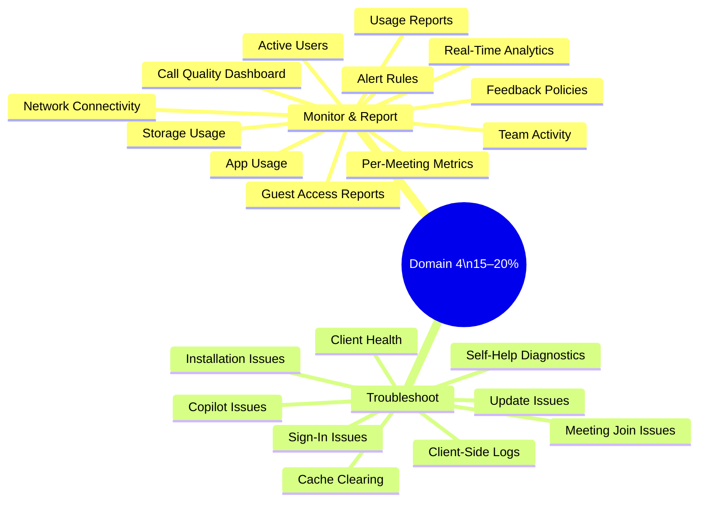
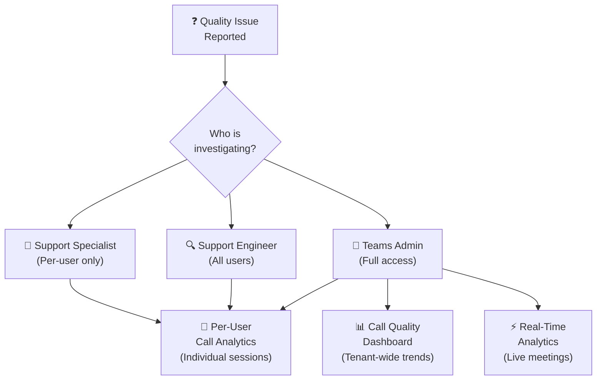
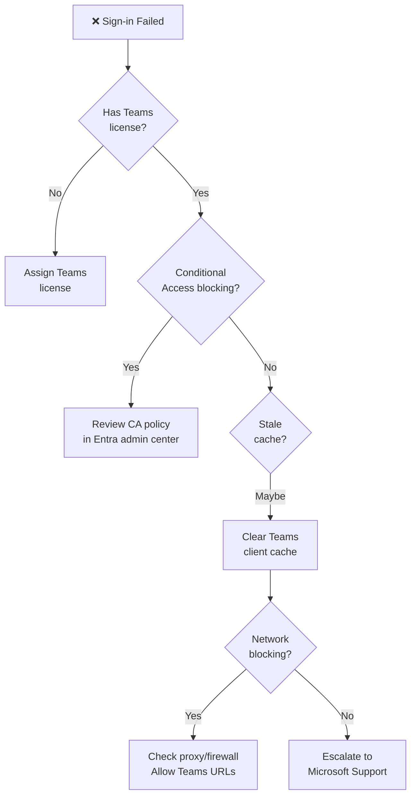

# 04 — Monitor, Report & Troubleshoot Teams 15–20%
> - Based on: *[MS-700 Study Guide](https://learn.microsoft.com/en-us/credentials/certifications/resources/study-guides/ms-700)*
> - 📁 [← Back to Home](/ms-700-study-notes/)

---

## 🗺 Domain Overview

---

## 📊 4.1 Monitor and Report on Teams

### Call Quality Dashboard (CQD)

The primary tool for monitoring **voice and meeting quality** across the tenant:

| Feature | Description |
|---------|-------------|
| **Access** | cqd.teams.microsoft.com or Teams admin center |
| **Data** | Call and meeting quality metrics — up to 30 days |
| **Building data** | Upload building/subnet data for location-based reporting |
| **Reports** | Pre-built and custom reports on audio, video, and screen sharing quality |
| **Dimensions** | Filter by date, user, building, network, client, device |

### Key CQD Metrics

| Metric | Good Threshold | Description |
|--------|---------------|-------------|
| **Packet loss** | < 1% | Percentage of packets lost during transmission |
| **Jitter** | < 30 ms | Variation in packet arrival time |
| **Latency (round-trip)** | < 100 ms | Time for packet to travel to destination and back |
| **Audio poor stream rate** | < 3% | Percentage of audio streams classified as poor |

### Real-Time Analytics

Available in **Teams admin center** → Analytics & reports → Real-time analytics:
- View **active meetings** happening now
- See per-participant quality (audio, video, screen sharing)
- Identify issues during live meetings
- Available for meetings with **3+ participants**

### Per-User Call Analytics

| Role | Access Level |
|------|-------------|
| **Teams Communications Support Specialist** | Per-user data only — sees individual user call history |
| **Teams Communications Support Engineer** | All user data — advanced troubleshooting and analytics |
| **Teams Administrator** | Full access to all analytics |

### Usage Reports

Available in **Teams admin center** → Analytics & reports → Usage reports:

| Report | Shows |
|--------|-------|
| **Teams usage** | Active users, active teams, guests, messages, channels |
| **Team activity** | Per-team metrics — messages, active users, guests |
| **App usage** | Which apps are installed and actively used |
| **Active users** | Daily, weekly, monthly active users |
| **Per-meeting metrics** | Duration, participants, audio/video quality per meeting |
| **Storage usage** | How much storage each team is consuming |
| **Guest access** | Guest activity, guest count, teams with guests |
| **PSTN usage** | Call minutes, cost, number usage (if using Calling Plans) |
| **PSTN blocked users** | Users blocked from making PSTN calls |

### M365 Admin Center Reports

Additional Teams reporting available via **M365 admin center** → Reports → Usage:
- **Microsoft 365 usage analytics** — Power BI template for deeper analysis
- Cross-service reports (Teams + Exchange + SharePoint activity)

### Alert Rules

Configure notifications for specific events in **Teams admin center** → Notifications & alerts:

| Alert Type | Trigger |
|-----------|---------|
| **Device health** | Teams device goes offline or has issues |
| **Meeting quality** | Audio quality drops below threshold |
| **External access** | Changes to external access settings |
| **App events** | App installation or permission changes |

### Monitor Team Creation and Deletion

| Method | Description |
|--------|-------------|
| **Audit log** | Microsoft Purview → Audit — search for TeamCreated, TeamDeleted events |
| **Activity log** | Teams admin center — recent admin actions |
| **Microsoft Graph** | Query change notifications for group lifecycle events |
| **PowerShell** | `Get-Team` with filters for creation date |

### Feedback Policies

| Setting | Description |
|---------|-------------|
| **Give feedback** | Allow/block users from sending feedback to Microsoft |
| **Surveys** | Allow/block in-app surveys after calls/meetings |
| **Log collection** | Allow users to send logs with feedback |
| **Feature suggestions** | Allow/block feature suggestion submissions |

> **⚠️ Exam Caveat:**
> - **CQD** shows tenant-wide trends; **per-user call analytics** shows individual session details — know when to use each
> - **Building/subnet data** must be uploaded to CQD for location-based quality reporting
> - **Support Specialist** role can ONLY see per-user data (they must search by user) — they cannot see tenant-wide reports
> - **Real-time analytics** requires meetings with **3+ participants** — not available for 1:1 calls
> - **Usage reports** have a data latency of **24–48 hours** — they are not real-time

---

## 🔧 4.2 Troubleshoot Audio, Video, and Client Issues

### Client-Side Logs

| Log Type | Location (Windows) | Purpose |
|----------|-------------------|---------|
| **Desktop client logs** | `%appdata%\Microsoft\Teams\logs.txt` | General client activity and errors |
| **Media logs** | `%appdata%\Microsoft\Teams\media-stack\*.blog` | Audio, video, and screen sharing diagnostics |
| **Debug logs** | Ctrl+Alt+Shift+1 in Teams | Generate debug log package |
| **Calling logs** | Exported from call history | Per-call quality details |

### Clear Teams Client Cache

Steps to clear the cache (Windows):
1. Fully quit Teams (right-click tray icon → Quit)
2. Navigate to `%appdata%\Microsoft\Teams`
3. Delete contents of: `Cache`, `blob_storage`, `databases`, `GPUcache`, `IndexedDB`, `Local Storage`, `tmp`
4. Restart Teams

### Self-Help Diagnostics

Available in **Microsoft 365 admin center** → Support → Run diagnostics:

| Diagnostic | Tests |
|-----------|-------|
| **Teams sign-in** | Validates user account, license, and service health |
| **Teams meeting** | Checks meeting policies, licenses, and connectivity |
| **Teams calendar** | Validates Exchange mailbox and calendar integration |
| **Teams call quality** | Analyzes recent call quality data for a user |
| **Teams presence** | Checks presence status and coexistence mode |

### Client Installation and Update Issues

| Issue | Troubleshooting Steps |
|-------|----------------------|
| **Installation fails** | Check .NET prerequisites, run as admin, check proxy/firewall |
| **Updates not applying** | Verify update policy, check network connectivity to CDN |
| **New Teams migration** | Check update policy settings, OS requirements |
| **Side-by-side install** | Classic Teams and new Teams can coexist during transition |

### Client Health in Teams Admin Center

| Feature | Description |
|---------|-------------|
| **Teams devices health** | Monitor device status, connectivity, and peripherals |
| **Client version report** | See which Teams client versions are in use |
| **App health** | Monitor Teams app performance metrics |

### Sign-In Issues

| Common Cause | Resolution |
|-------------|-----------|
| **No Teams license** | Assign license in M365 admin center |
| **Conditional Access** | Review policies in Entra — may block non-compliant devices |
| **Cached credentials** | Clear Teams cache and re-sign in |
| **Proxy/firewall** | Allow Teams URLs and IPs (see Microsoft 365 URLs and IP address ranges) |
| **SSO issues** | Check Entra ID sign-in logs for error codes |
| **MFA enrollment** | User may need to complete MFA registration |

### Troubleshoot Copilot and AI in Teams

| Issue | Check |
|-------|-------|
| **Copilot not available** | Verify Microsoft 365 Copilot license assigned |
| **No meeting recap** | Check that **transcription is enabled** in meeting policy |
| **Copilot disabled in policy** | Review meeting policy Copilot settings |
| **Poor Copilot output** | Ensure meeting had **transcription running** during the meeting |

### Meeting Join and Feature Issues

| Issue | Troubleshooting |
|-------|----------------|
| **Cannot join meeting** | Check meeting policy, anonymous join settings, lobby policy |
| **No audio/video** | Check device permissions, media ports (UDP 3478–3481), drivers |
| **Cannot share screen** | Check meeting policy (content sharing), bandwidth |
| **Recording unavailable** | Check recording policy, OneDrive/SharePoint storage quota |
| **Missing features** | Check Teams client version, license, meeting policy |
| **Lobby issues** | Review meeting policy lobby bypass settings |

> **⚠️ Exam Caveat:**
> - **Debug logs** are generated by pressing **Ctrl+Alt+Shift+1** — know this keyboard shortcut
> - **Self-help diagnostics** are in the **M365 admin center**, not the Teams admin center
> - **Cache clearing** resolves many client issues — it's a standard first troubleshooting step
> - **Sign-in log analysis** should be done in **Entra admin center** → Sign-in logs
> - **Copilot requires transcription** — if transcription is disabled by policy, Copilot cannot function in meetings

---

## 📝 Domain 4 — Quick-Reference Scenarios

| Scenario | Answer |
|----------|--------|
| Users report poor audio quality across the org | **Call Quality Dashboard** (CQD) — check audio poor stream rate |
| Manager needs to see an employee's call quality | **Per-user call analytics** (Support Specialist or Engineer role) |
| Monitor a live all-hands meeting for quality | **Real-time analytics** in Teams admin center |
| Find out which Teams apps are most used | **Usage reports** → App usage |
| Investigate who deleted a team | **Audit log** in Microsoft Purview — search TeamDeleted |
| User cannot sign in to Teams on a new device | Check **Conditional Access** policies + **Teams license** |
| Teams client is slow and glitchy | **Clear Teams client cache** |
| Generate a debug log for Microsoft support | Press **Ctrl+Alt+Shift+1** in Teams |
| CQD shows poor quality for a specific building | Upload **building/subnet data** to CQD, then filter by building |
| Copilot doesn't show meeting recap | Verify **transcription** is enabled in the meeting policy |

---

[📞 ← Domain 3](/ms-700-study-notes/03-meetings-and-calling/) · [⚡ Next: Quick Reference Cheatsheet →](/ms-700-study-notes/05-quick-reference-cheatsheet/)
