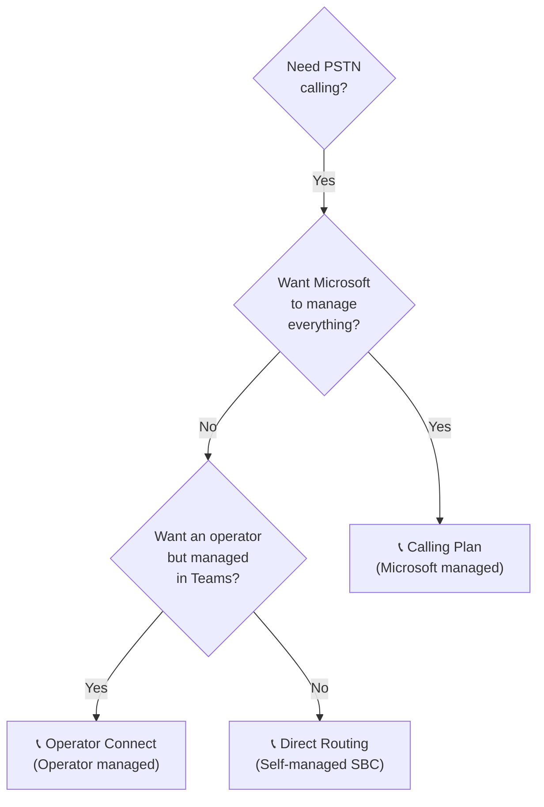
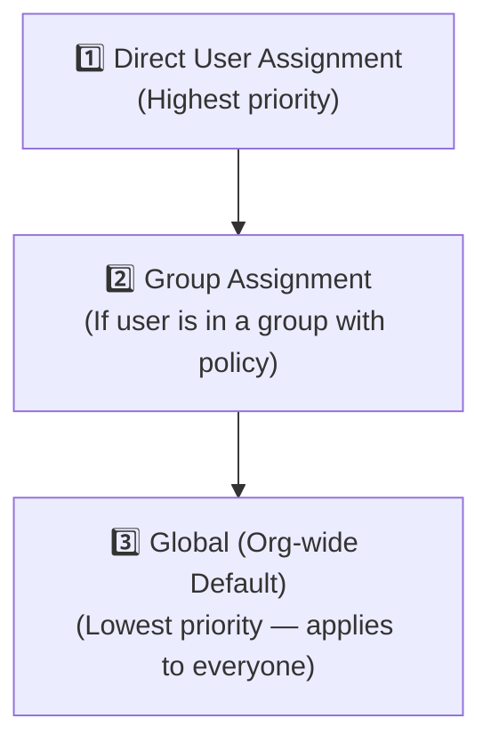

# 05 — Quick Reference Cheatsheet ⚡
> - 📁 [← Back to Home](/ms-700-study-notes/)

---

## 🔢 Key Numbers to Memorize

| Item | Limit |
|------|-------|
| Max members per team | **25,000** |
| Max owners per team | **100** |
| Max teams per user | **1,000** |
| Max channels per team (standard) | **1,000** (incl. deleted within 30 days) |
| Max private channels per team | **30** |
| Max shared channels per team | **1,000** |
| Max org-wide teams per tenant | **5** |
| Max members in org-wide team | **10,000** |
| Soft-delete recovery window | **30 days** |
| Meeting max participants (interactive) | **1,000** |
| Meeting max participants (view-only) | **20,000** |
| Webinar max attendees | **1,000** |
| Town hall max attendees | **10,000** (20,000 with premium) |
| Auto-attendant nested depth | **10 levels** |
| Call queue max agents | **200** |
| Max apps per team | **Unlimited** (tab apps limited by channel) |

---

## 🖥️ Admin Portals Quick Reference

| Task | Portal |
|------|--------|
| Meeting policies, calling, devices | **Teams Admin Center** (admin.teams.microsoft.com) |
| User licenses, M365 groups | **M365 Admin Center** (admin.microsoft.com) |
| Conditional Access, B2B, guest settings | **Entra Admin Center** (entra.microsoft.com) |
| External sharing for files | **SharePoint Admin Center** |
| DLP, retention, sensitivity labels, eDiscovery | **Microsoft Purview** (compliance.microsoft.com) |
| Threat policies (Safe Links, Safe Attachments) | **Microsoft Defender** (security.microsoft.com) |
| Self-help diagnostics | **M365 Admin Center** → Support |
| Call Quality Dashboard | **cqd.teams.microsoft.com** |
| Audit logs | **Microsoft Purview** → Audit |

---

## 🔄 External Access vs. Guest Access

| Feature | External Access | Guest Access |
|---------|----------------|--------------|
| Identity | Home tenant | Guest in your Entra ID |
| Scope | 1:1 chat, calls | Full team membership |
| File sharing | No | Yes |
| Team membership | No | Yes |
| Configured in | Teams admin center | Multiple portals |
| Domain control | Allow/deny lists | B2B settings in Entra |
| Licensing | No license in your tenant | Covered by your tenant's license |

---

## 📞 PSTN Connectivity Decision



---

## 📋 Channel Type Decision

| Question | Standard | Private | Shared |
|----------|----------|---------|--------|
| All team members need access? | ✅ | ❌ | ❌ |
| Subset of team members only? | ❌ | ✅ | ❌ |
| Cross-team collaboration? | ❌ | ❌ | ✅ |
| External org collaboration? | ❌ | ❌ | ✅ |
| Separate SharePoint site? | ❌ | ✅ | ✅ |
| Guest access supported? | ✅ | ✅ | ❌ |
| Uses B2B direct connect? | ❌ | ❌ | ✅ |

---

## 📅 Meeting Type Decision

| Need | Recommendation |
|------|---------------|
| Team standup (10 people, interactive) | **Meeting** |
| Product demo to 500 prospects with registration | **Webinar** |
| CEO address to 8,000 employees | **Town Hall** |
| Doctor-patient consultation (booked) | **Virtual Appointment** |
| Training session (50 people, Q&A) | **Meeting** or **Webinar** |
| Company earnings broadcast (10,000+) | **Town Hall** |

---

## 🔑 Policy Assignment Hierarchy

Policies are applied in this priority order (highest to lowest):



> **⚠️ Exam Caveat:** If a user has a **directly assigned** policy AND belongs to a **group** with a different policy, the **direct assignment wins**.

---

## 🔧 Essential PowerShell Commands

```powershell
# Connect to Teams
Connect-MicrosoftTeams

# Team management
Get-Team
New-Team -DisplayName "Sales Team" -Visibility Private
Set-Team -GroupId <id> -Description "Updated description"
Remove-Team -GroupId <id>
Add-TeamUser -GroupId <id> -User user@domain.com -Role Owner

# Channel management
Get-TeamChannel -GroupId <id>
New-TeamChannel -GroupId <id> -DisplayName "Projects" -MembershipType Private
Remove-TeamChannel -GroupId <id> -DisplayName "Old Channel"

# Policy management
Get-CsTeamsMeetingPolicy
Set-CsTeamsMeetingPolicy -Identity "Custom Policy" -AllowTranscription $true
Grant-CsTeamsMeetingPolicy -Identity user@domain.com -PolicyName "Custom Policy"

# Messaging policies
Get-CsTeamsMessagingPolicy
Grant-CsTeamsMessagingPolicy -Identity user@domain.com -PolicyName "Restrictive"

# Calling
Get-CsOnlineUser -Identity user@domain.com | Select-Object LineUri, EnterpriseVoiceEnabled
Set-CsPhoneNumberAssignment -Identity user@domain.com -PhoneNumber "+1234567890" -PhoneNumberType CallingPlan

# Bulk operations
Get-CsOnlineUser -Filter {Department -eq "Sales"} | Grant-CsTeamsMeetingPolicy -PolicyName "SalesPolicy"

# Restrict M365 group creation (Entra ID)
# Requires AzureAD or Microsoft.Graph module
```

---

## ⚠️ Common Exam Traps

| Trap | Correct Answer |
|------|---------------|
| "Where to configure Conditional Access for Teams?" | **Entra admin center** — target the Office 365 cloud app |
| "Where to restrict M365 group creation?" | **PowerShell** (Entra ID) — NOT M365 admin center UI |
| "Shared channels support guest access" | **False** — shared channels use B2B direct connect, NOT guest access |
| "Private channel files are on the team's SharePoint site" | **False** — private channels get their **own** SharePoint site collection |
| "CQD shows real-time data" | **False** — CQD data has a processing delay; use **real-time analytics** for live data |
| "Support Specialist can see all user analytics" | **False** — Specialist sees **per-user only**; Engineer sees all users |
| "Town halls support interactive chat" | **False** — Town halls only support **Q&A**, not full chat |
| "Meeting templates set defaults; meeting policies enforce limits" | **True** — templates can lock settings; policies apply to all meetings for a user |
| "Teams Phone Resource Account license has a cost" | **False** — it's a **free** license |
| "Expiration policies auto-delete groups immediately" | **False** — owners get notifications at **30, 15, and 1 day** before expiration |
| "Webinars don't require registration" | **False** — registration is **required** for webinars |
| "Copilot works without transcription" | **False** — Copilot in meetings **requires transcription** to be enabled |
| "Information barriers use group membership" | **False** — IB uses **user segments** based on Entra ID attributes |

---

## 🎯 Network Quality Thresholds

| Metric | Target | Poor |
|--------|--------|------|
| Latency (round-trip) | **< 100 ms** | > 500 ms |
| Jitter | **< 30 ms** | > 30 ms |
| Packet loss | **< 1%** | > 10% |
| Audio poor stream rate | **< 3%** | > 3% |

---

## 🔒 Security & Compliance Feature → License Map

| Feature | M365 E3 | M365 E5 | Add-on Required |
|---------|---------|---------|----------------|
| Retention policies | ✅ | ✅ | — |
| Sensitivity labels (basic) | ✅ | ✅ | — |
| Sensitivity labels (auto) | ❌ | ✅ | E5 Compliance |
| DLP for Teams | ❌ | ✅ | E5 Compliance |
| Information barriers | ❌ | ✅ | E5 Compliance |
| Communication compliance | ❌ | ✅ | E5 Compliance |
| eDiscovery (Premium) | ❌ | ✅ | E5 eDiscovery |
| Safe Links/Attachments | ❌ | ✅ | Defender for O365 |
| Audio Conferencing | ❌ | ✅ | Audio Conferencing add-on |
| Phone System | ❌ | ✅ | Teams Phone Standard |

---

## ✅ Pre-Exam Checklist

- [ ] Can I explain the difference between **external access** and **guest access**?
- [ ] Do I know which **admin portal** is used for each configuration task?
- [ ] Can I choose the right **channel type** (standard, private, shared) for a scenario?
- [ ] Do I understand the **meeting type** differences (meeting, webinar, town hall, virtual appointment)?
- [ ] Can I design a **Teams Phone** solution (Calling Plans vs. Operator Connect vs. Direct Routing)?
- [ ] Do I know how **auto-attendants** and **call queues** work together?
- [ ] Can I interpret **CQD metrics** and identify quality issues?
- [ ] Do I know the **troubleshooting steps** for sign-in and client issues?
- [ ] Am I comfortable with **Teams PowerShell** for common admin tasks?
- [ ] Do I understand **policy assignment** priority (direct > group > global)?
- [ ] Can I identify the correct **license** for each feature?
- [ ] Do I know the **key limits** (team size, channel counts, meeting capacity)?
- [ ] Can I explain how **sensitivity labels** affect Teams?
- [ ] Do I understand **B2B direct connect** for shared channels?
- [ ] Am I clear on **Copilot** requirements (license + transcription)?

---

## 📚 Final Study Resources

| Resource | Link |
|----------|------|
| 📋 Official Study Guide | [MS-700 Study Guide](https://learn.microsoft.com/en-us/credentials/certifications/resources/study-guides/ms-700) |
| 🧪 Practice Assessment | [Free Practice Test](https://learn.microsoft.com/en-us/credentials/certifications/exams/ms-700/practice/assessment?assessment-type=practice&assessmentId=55) |
| 📖 Teams Admin Docs | [Microsoft Teams Documentation](https://learn.microsoft.com/en-us/MicrosoftTeams/) |
| 📞 Teams Phone Docs | [Teams Phone Documentation](https://learn.microsoft.com/en-us/MicrosoftTeams/what-is-phone-system-in-office-365) |
| 🔒 Teams Security | [Security & Compliance in Teams](https://learn.microsoft.com/en-us/MicrosoftTeams/security-compliance-overview) |
| 📊 CQD Guide | [Call Quality Dashboard](https://learn.microsoft.com/en-us/MicrosoftTeams/turning-on-and-using-call-quality-dashboard) |

---

[📊 ← Domain 4](/ms-700-study-notes/04-monitor-report-troubleshoot/) · [📘 Back to Home →](/ms-700-study-notes/)
