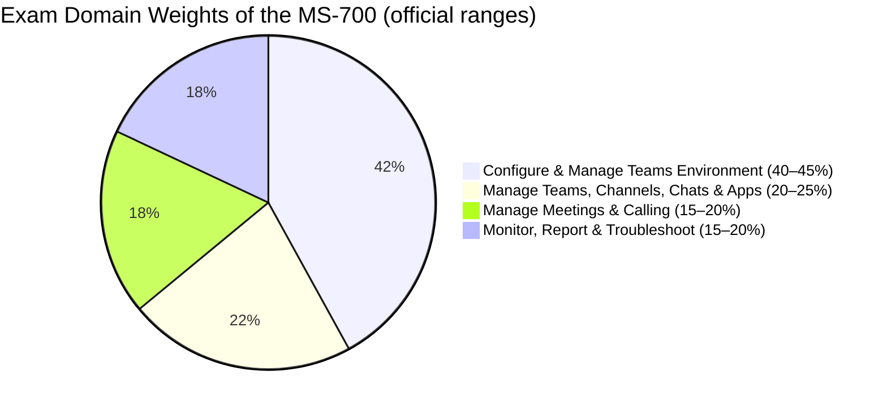
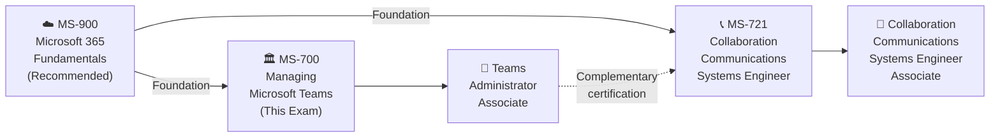

# 📘 MS-700: Managing Microsoft Teams
### Study Notes Repository 

[](https://github.com/marcogrimaldi29/ms-700-study-notes/actions/workflows/pages.yml)
[](https://github.com/marcogrimaldi29/ms-700-study-notes)
[](https://marcogrimaldi29.com)

> - 🎯 **Goal:** Earn the Microsoft 365 Certified: Teams Administrator Associate badge
> - 📅 **Notes Version:** 2026
> - 🌐 **Published site:** [📘 MS-700 Study Notes](https://marcogrimaldi29.com/ms-700-study-notes/)
> - ✍️ **Author:** [Marco Grimaldi](https://www.linkedin.com/in/marco-grimaldi29/)
> - 🛬 **Main Landing Page:** [🛬 Landing Page: Study Notes](https://marcogrimaldi29.com/study-notes/)
> - 🏅 **Cert Review Article**: [🏅 Cert Review: MS-700 – Microsoft 365 Certified: Teams Administrator Associate](https://marcogrimaldi29.com/microsoft-ms-700/)
---

## 📋 Exam At-a-Glance

| Detail | Info |
|--------|------|
| 🏅 Certification | Microsoft 365 Certified: Teams Administrator Associate |
| 📝 Passing Score | **700 / 1000** |
| 💶 Exam Price | **~€126 EUR** *(varies by EU country & Pearson VUE location; VAT may apply)* |
| ⏱️ Duration | **~120 minutes** |
| ❓ Question Types | MCQ, multi-select, drag-and-drop, case studies |
| 🔁 Renewal | **Annual** via free online assessment on Microsoft Learn |
| 🛡️ Prerequisite | None *(recommended: familiarity with M365 admin, networking, and identity)* |

---

## 📊 Official Domain Breakdown

> ⚠️ **Official ranges** from the Microsoft study guide (updated April 2026)



| # | Domain | Official Weight | Key Topics |
|---|--------|----------------|------------|
| 1 | Configure & Manage a Teams Environment | **40–45%** | Network planning, security & compliance, governance, external collaboration, devices |
| 2 | Manage Teams, Channels, Chats & Apps | **20–25%** | Team creation, channel types, messaging policies, app management |
| 3 | Manage Meetings & Calling | **15–20%** | Meeting policies, Teams Phone, auto-attendants, call queues, webinars |
| 4 | Monitor, Report & Troubleshoot Teams | **15–20%** | Call quality, usage reports, client troubleshooting, diagnostics |

> 🔑 **Domain 1 = heaviest domain** — allocate ≥40% of total study time here.

---

## 🗺 Certification Path



> 💡 **MS-700** focuses on **Teams administration** (policies, governance, compliance). **[MS-721](https://learn.microsoft.com/en-us/credentials/certifications/m365-collaboration-communications-systems-engineer/)** focuses on **Teams Phone, meetings infrastructure, and certified devices** (SBCs, Teams Rooms, call quality). Together they cover the full Microsoft Teams certification spectrum.

---

## 🗂️ Repository Structure

```
ms-700-study-notes/
├── README.md                             ← 📍 You are here
├── 00-teams-fundamentals.md              ← Core Teams & M365 concepts
├── 01-configure-manage-environment.md    ← Domain 1 (40–45%)
├── 02-teams-channels-chats-apps.md       ← Domain 2 (20–25%)
├── 03-meetings-and-calling.md            ← Domain 3 (15–20%)
├── 04-monitor-report-troubleshoot.md     ← Domain 4 (15–20%)
└── 05-quick-reference-cheatsheet.md      ← Last-minute review & exam traps
```

---

## 📚 Official Learning Resources

| Resource | Link |
|----------|------|
| 📚 Microsoft's MS-700 Certification Page | [Certification Page](https://learn.microsoft.com/en-us/credentials/certifications/m365-teams-administrator-associate/) |
| 📋 Skills Measured / Study Guide | [Official Study Guide](https://learn.microsoft.com/en-us/credentials/certifications/resources/study-guides/ms-700) |
| 🧪 Free Practice Assessment | [Practice Assessment](https://learn.microsoft.com/en-us/credentials/certifications/exams/ms-700/practice/assessment?assessment-type=practice&assessmentId=55) |
| 📖 MS-700T00 Training Course | [Instructor-Led Course](https://learn.microsoft.com/en-us/training/courses/ms-700t00) |
| 📄 Microsoft Teams Admin Documentation | [Teams Admin Docs](https://learn.microsoft.com/en-us/MicrosoftTeams/) |
| 🎬 Exam Readiness Videos | [Exam Readiness Zone](https://learn.microsoft.com/en-us/shows/exam-readiness-zone/) |
| 💶 EU Exam Pricing | [Pearson VUE Microsoft](https://home.pearsonvue.com/microsoft) |

---

### ✅ Key Study Tips

- 🎯 The exam tests **admin-level configuration**, not end-user functionality — think policies and governance
- 🔄 Know the difference between **Teams admin center**, **M365 admin center**, **Entra admin center**, and **SharePoint admin center** scopes
- 💡 Understand **external access vs. guest access** — this distinction appears frequently
- 📐 Study **Teams Phone architecture** — auto-attendants, call queues, and calling policies are heavily tested
- ⚡ Domain 1 is nearly half the exam — **security, compliance, and governance** are critical
- 📊 Know **CQD (Call Quality Dashboard)** and how to read quality reports
- 📖 For scenario questions: identify the **least-privilege admin role** and the **correct admin portal** first

---

## ⚡ Quick Navigation

| File | Topics Covered |
|------|---------------|
| [📘 00 — Teams Fundamentals](./00-teams-fundamentals.md) | M365 integration, Teams architecture, licensing, admin portals |
| [🔧 01 — Configure & Manage Environment](./01-configure-manage-environment.md) | Network, security, compliance, governance, external collab, devices |
| [💬 02 — Teams, Channels, Chats & Apps](./02-teams-channels-chats-apps.md) | Team creation, channel types, messaging, app management |
| [📞 03 — Meetings & Calling](./03-meetings-and-calling.md) | Meeting policies, Teams Phone, auto-attendants, call queues |
| [📊 04 — Monitor, Report & Troubleshoot](./04-monitor-report-troubleshoot.md) | CQD, usage reports, client diagnostics, troubleshooting |
| [⚡ 05 — Quick Reference Cheatsheet](./05-quick-reference-cheatsheet.md) | Key numbers, decision tables, exam traps, final checklist |

---

## 📚 About the Study Notes

These notes are hosted on **GitHub Pages** and published as a searchable website on this URL:

👉 **[📘 MS-700 Study Notes](https://marcogrimaldi29.com/ms-700-study-notes/)**

The site includes full-text search, Mermaid diagram rendering, and mobile-friendly navigation for on-the-go review. 

These notes are designed to be a structured, exam-focused summary of the most important concepts and services based on the official [Microsoft MS-700 Study Guide](https://learn.microsoft.com/en-us/credentials/certifications/resources/study-guides/ms-700) and its criteria.

Additional study notes maintained by me are also available for those pursuing Microsoft and Azure certifications at the following Landing Page:

👉 **[🛬 Landing Page: Study Notes](https://marcogrimaldi29.com/study-notes/)**

---

## ✍️ About the Author

Maintained by **[Marco Grimaldi](https://www.linkedin.com/in/marco-grimaldi29/)** — Cloud Consultant, Language Trainer & Lifelong Learner.

🏠 Find more certification guides, study tips, and tech content at **[🌐 marcogrimaldi29.com](https://marcogrimaldi29.com)**

The site is continuously updated and based on my personal study notes and experiences. If you have any feedback, suggestions, or corrections, feel free to [reach out](https://marcogrimaldi29.com/contact/)!

---

## 📈 Analytics

This site uses **[Umami](https://umami.is/)** for privacy-friendly analytics.

---

## ©️ Credits & Acknowledgements

The **[Just the Docs](https://github.com/just-the-docs/just-the-docs)** theme is used for a clean, documentation-style layout. Licensed under [MIT](https://opensource.org/license/MIT).

Created with the help of AI. Model used: **[Claude Opus 4.6](https://www.anthropic.com/)**. The content has been reviewed and edited by the author for accuracy and clarity, but may contain errors. Always verify against the latest [Microsoft documentation](https://learn.microsoft.com/en-us/MicrosoftTeams/).

> *Not affiliated with or endorsed by Microsoft.*

---
