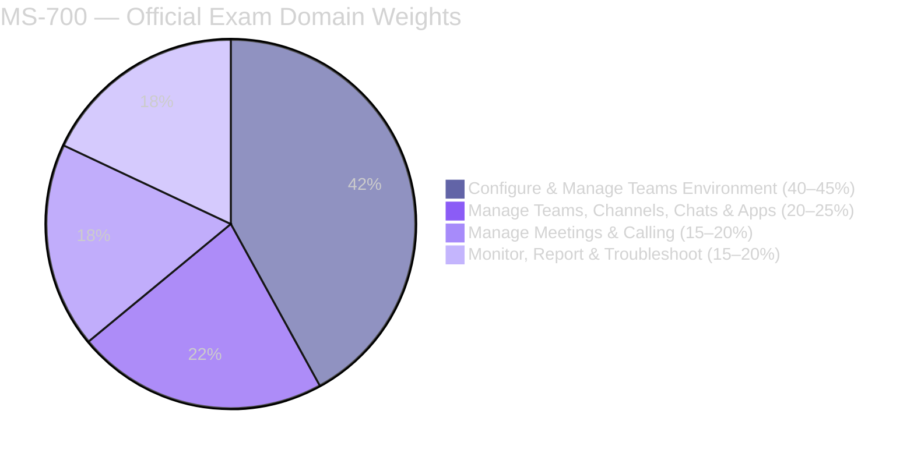
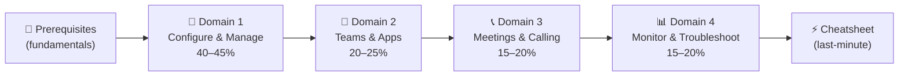

# 📘 MS-700 Study Notes
{: .no_toc }

**Microsoft 365 Certified: Teams Administrator Associate**
{: .fs-5 .fw-300 }

[Start Studying →](/ms-700-study-notes/00-teams-fundamentals){: .btn .btn-primary .fs-5 .mb-4 .mb-md-0 .mr-2 }
[View on GitHub](https://github.com/marcogrimaldi29/ms-700-study-notes){: .btn .fs-5 .mb-4 .mb-md-0 target="_blank" }

---

> 🏠 These notes are maintained by **[Marco Grimaldi](https://www.linkedin.com/in/marco-grimaldi29/)** and based on the **[official Microsoft documentation](https://learn.microsoft.com/en-us/credentials/certifications/m365-teams-administrator-associate/)**.
> Find more certification guides, study tips, and tech content at **[🌐 marcogrimaldi29.com](https://marcogrimaldi29.com)**.
> Related Cert Review Article: **[🏅 Cert Review: MS-700 – Microsoft 365 Certified: Teams Administrator Associate](https://marcogrimaldi29.com/microsoft-ms-700/)**.
> *Not affiliated with or endorsed by Microsoft. Always verify against the latest Microsoft documentation.*

---

## 🎯 Exam Overview

| Detail | Value |
|--------|-------|
| 🏅 Certification | **Microsoft 365 Certified: Teams Administrator Associate** |
| 📝 Passing Score | **700 / 1000** |
| 💶 Price (EU) | **~€126** *(varies by country, VAT may apply)* |
| ⏱️ Duration | **~120 minutes** |
| 🔁 Renewal | **Annual** — free online assessment on Microsoft Learn |
| 🛡️ Prerequisite | **None** *(M365, networking & identity experience recommended)* |

---

## 📊 Domain Weights

| # | Domain | Weight | Key Focus Areas |
|---|--------|--------|----------------|
| 1 | [Configure & Manage a Teams Environment](./01-configure-manage-environment/) | **40–45%** | Network, security, compliance, governance, external collab, devices |
| 2 | [Manage Teams, Channels, Chats & Apps](./02-teams-channels-chats-apps/) | **20–25%** | Team creation, channel types, messaging policies, app management |
| 3 | [Manage Meetings & Calling](./03-meetings-and-calling/) | **15–20%** | Meeting policies, Teams Phone, auto-attendants, call queues |
| 4 | [Monitor, Report & Troubleshoot](./04-monitor-report-troubleshoot/) | **15–20%** | CQD, usage reports, client diagnostics, troubleshooting |

---

## 🗂️ Notes Index

<h3 style="margin-top:0;">📘 Prerequisites</h3>

Core Teams & M365 concepts: architecture, licensing, admin portals, identity integration, and Teams client basics.

<a href="./00-teams-fundamentals/" class="btn btn-outline fs-5">Read →</a>

<h3 style="margin-top:0;">🔧 Domain 1 — Configure & Manage</h3>

<strong>40–45%</strong> of exam. Network planning, security & compliance, governance, external collaboration, devices.

<a href="./01-configure-manage-environment/" class="btn btn-outline fs-5">Read →</a>

<h3 style="margin-top:0;">💬 Domain 2 — Teams & Apps</h3>

<strong>20–25%</strong> of exam. Team creation, channel types (standard, private, shared), messaging policies, app management.

<a href="./02-teams-channels-chats-apps/" class="btn btn-outline fs-5">Read →</a>

<h3 style="margin-top:0;">📞 Domain 3 — Meetings & Calling</h3>

<strong>15–20%</strong> of exam. Meeting types, policies, Teams Phone, auto-attendants, call queues, webinars, town halls.

<a href="./03-meetings-and-calling/" class="btn btn-outline fs-5">Read →</a>

<h3 style="margin-top:0;">📊 Domain 4 — Monitor & Troubleshoot</h3>

<strong>15–20%</strong> of exam. CQD, usage reports, alert rules, client-side logs, diagnostics, troubleshooting flows.

<a href="./04-monitor-report-troubleshoot/" class="btn btn-outline fs-5">Read →</a>

<h3 style="margin-top:0;">⚡ Quick Reference Cheatsheet</h3>

Key numbers, admin portals, policy comparison tables, PowerShell commands, exam traps, and pre-exam checklist.

<a href="./05-quick-reference-cheatsheet/" class="btn btn-outline fs-5">Read →</a>

---

## 🧠 How to Use These Notes

These notes are structured to follow the **official MS-700 study guide** domain order. The recommended reading flow:

### 💡 Study Tips

- 🎯 The exam tests **admin-level configuration** — think policies, governance, and compliance, not end-user features
- 🔄 Know which **admin portal** to use for each task — Teams admin center, M365 admin center, Entra, SharePoint
- 💡 **External access vs. guest access** is a high-frequency exam topic — know the differences cold
- 📊 **CQD and call quality reports** appear regularly in scenario questions
- ⚠️ Each section has **`Exam Caveats`** callouts — these are high-frequency exam traps
- 📞 Domain 1 is nearly half the exam — invest the most study time here

---

## 📄 Official Resources

| Resource | Link |
|----------|------|
| 🎓 Microsoft Certification Page | [MS-700 Certification](https://learn.microsoft.com/en-us/credentials/certifications/m365-teams-administrator-associate/) |
| 📋 Skills Measured Guide | [Official Study Guide](https://learn.microsoft.com/en-us/credentials/certifications/resources/study-guides/ms-700) |
| 🧪 Free Practice Assessment | [Practice Test](https://learn.microsoft.com/en-us/credentials/certifications/exams/ms-700/practice/assessment?assessment-type=practice&assessmentId=55) |
| 📖 Training Course | [MS-700T00](https://learn.microsoft.com/en-us/training/courses/ms-700t00) |
| 📄 Teams Admin Docs | [Teams Documentation](https://learn.microsoft.com/en-us/MicrosoftTeams/) |
| 💶 EU Exam Booking | [Pearson VUE Microsoft](https://home.pearsonvue.com/microsoft) |

---

## 📚 About the Study Notes

The site includes full-text search, Mermaid diagram rendering, and mobile-friendly navigation for on-the-go review. 

These notes are designed to be a structured, exam-focused summary of the most important concepts and services based on the official **[Microsoft MS-700 Study Guide](https://learn.microsoft.com/en-us/credentials/certifications/resources/study-guides/ms-700)** and its criteria.

Additional study notes maintained by me are also available for those pursuing Microsoft and Azure certifications at the following Landing Page:

👉 **[🛬 Landing Page: Study Notes](https://marcogrimaldi29.com/study-notes/)**

---

## ✍️ About the Author

These notes are maintained by **[Marco Grimaldi](https://www.linkedin.com/in/marco-grimaldi29/)** — Cloud Consultant, Language Trainer & Lifelong Learner.

📍 **Find more content at [🌐 marcogrimaldi29.com](https://marcogrimaldi29.com)**

> The website is continuously updated and based on my personal study notes and experiences. If you have any feedback, suggestions, or corrections, feel free to [reach out](https://marcogrimaldi29.com/contact/)!

---

## 📈 Analytics

This site uses **[Umami](https://umami.is/)** for privacy-friendly analytics.

---

## ©️ Credits & Acknowledgements

The **[Just the Docs](https://github.com/just-the-docs/just-the-docs)** theme is used for a clean, documentation-style layout. Licensed under [MIT](https://opensource.org/license/MIT).

Created with the help of AI. Model used: **[Claude Opus 4.6](https://www.anthropic.com/)**. The content has been reviewed and edited by the author for accuracy and clarity, but may contain errors. Always verify against the latest [Microsoft documentation](https://learn.microsoft.com/en-us/MicrosoftTeams/).

> *Not affiliated with or endorsed by Microsoft.*
